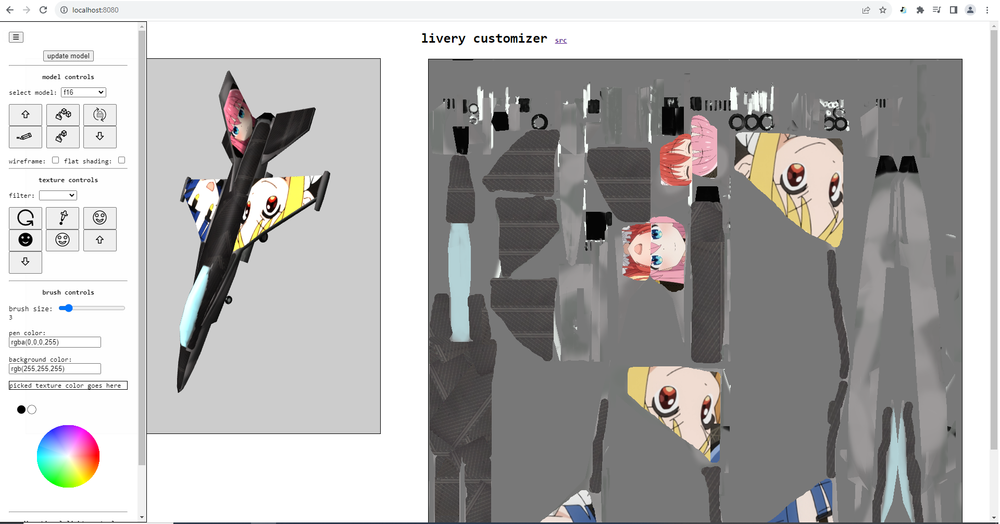
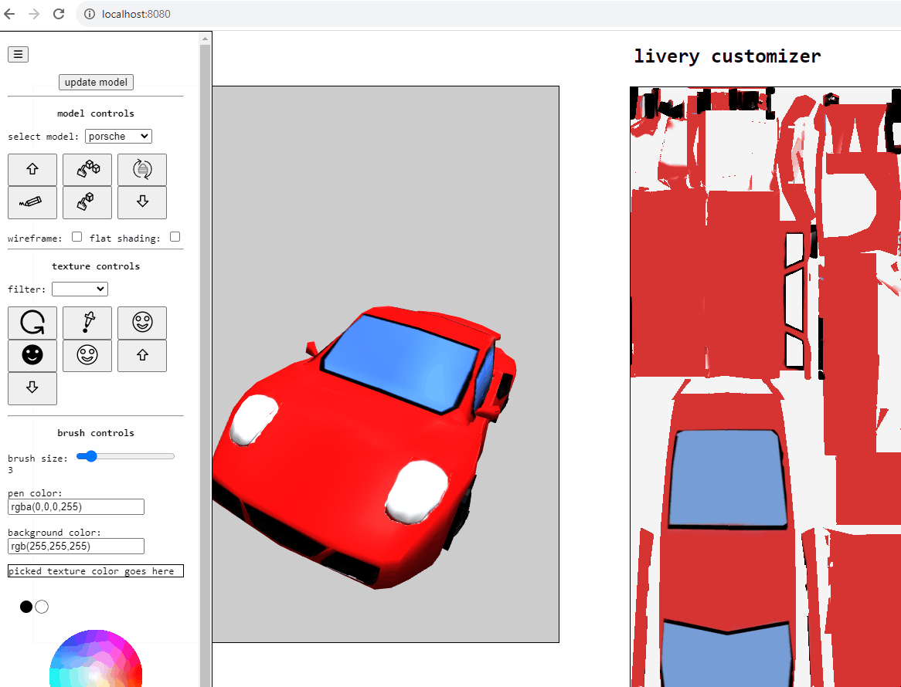
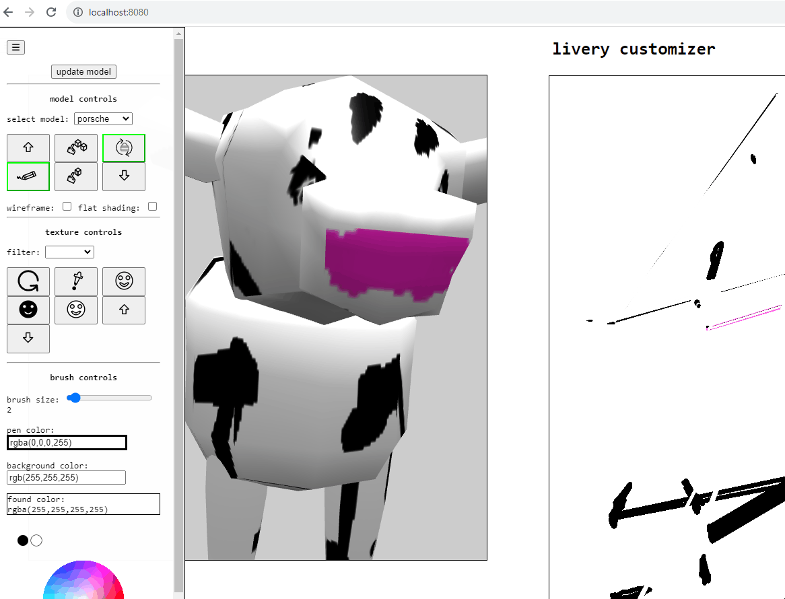
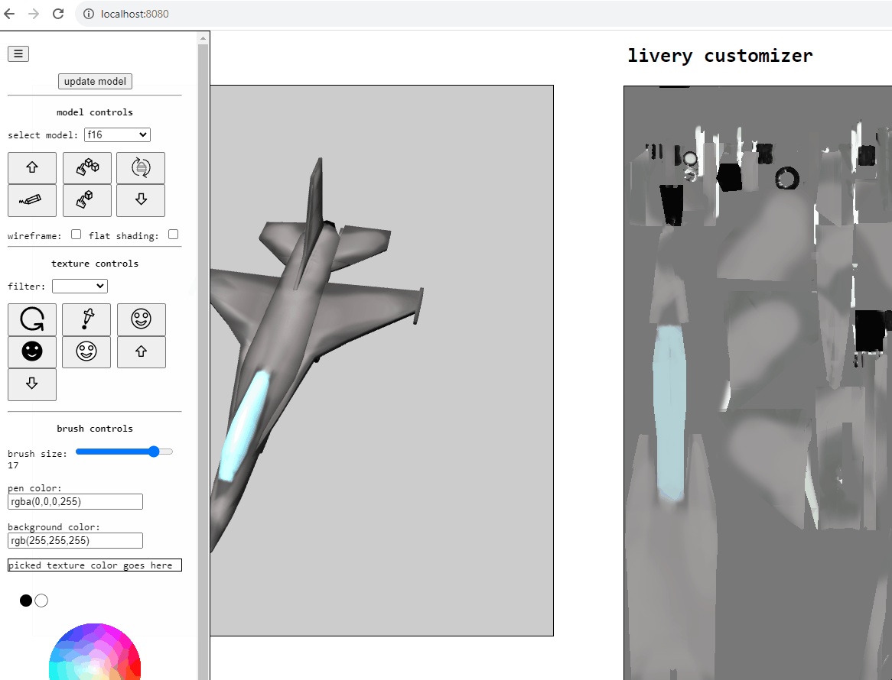

# livery    
    
create custom livery for 3d models! :D    
    
    
    
### instructions:    
Use a mouse to draw on the canvas below containing the texture of the model. Then click the 'update model' button (in the side panel) to apply changes.    
    
    
    
You can also draw directly on the model itself! :D (don't forget to lock trackball rotation first).    
    
    
    
You can also paste in an image via ctrl+v and drag it into place, as well as resize it by moving the mouse around after pressing the 's' key or rotate it with the mouse wheel after pressing the 'r' key. To apply a pasted image to the underlying canvas, click outside the texture canvas. To cancel, press esc.    
    
To use the masking layer, toggle it first. Then paint the area on the masking layer that you want to apply to the main layer. Afterwards you can paste an image over the area you just painted and only the part of the pasted image that matches the painted area will be extracted. Click outside the texture canvas to set the pasted image. Hit the 'apply masking layer' button to finalize changes and update the model with the 'update model' button.    
    
    
     
todo:    
- add shapes for drawing
- improve UI
- need a straightedge for masking?
- be able to display any animations?